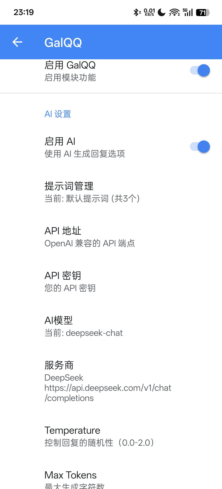

## 快速配置与启用（针对已ROOT的用户）
### 1.激活模块
 - **安装release内的.apk文件**
 - **打开 LSPosed，在模块列表中启用 GalQQ，并勾选 QQ 作为作用域**
 - **在设置中强行停止QQ客户端并重新打开，即可在设置中找到模块的设置页面**
 ### 2.配置AI
 **进入模块设置页面。**
**手动选择您的AI服务商，并填入API密钥。**

- **注意：除非必要，无需手动填写API地址，选择服务商后会自动更改。**

**下滑找到”测试API连接“并点击。若提示"API连接成功"，则说明配置无误，接下来就可以开始把QQ变成GalGame的样子了！**
###  关于API密钥的获取，请参考 [AI服务指南](service-get.md)
## 常见问题解答（FAQ）
### Q：提示“AI 返回格式无法识别”怎么办？
### A:一般情况下，这是因为maxtoken设置过小。可在通过在设置中手动提高该值解决问题。
### Q：AI回复太单调了，想要些风格化的回复？
### A:您可以加入我们的QQ群聊获取更多风格化的提示词，或者尝试自己撰写，并在“提示词管理“中添加。正常情况下，您只需要修改提示词内容，输入/输出格式不用填写，点击添加后会自动填充。
### Q：AI生成的回复傻傻的，完全和上下文没关联？
### A:您可以在模块设置中打开“启用对话上下文”选项，并调高上下文消息数。或者可以尝试使用更新的、更聪明的模型。
## 其他功能介绍
### 1.显示好感度
**基于空间亲密度计算得出，仅供娱乐。~~高好感度并不能触发特殊CG~~**
### 2.自动显示选项
**打开此选项后会自动对每条消息生成选项，但是会导致token被快速消耗。**
### 3.图片识别
**能让回复更加准确，但是代价同样是更多的token消耗。**
### 4.过滤设置
**可用于配置展示选项框的对话或群聊**
### 5.代理设置
**在插件内实现网络代理，提供某些服务商必须的网络环境**
## 对于未ROOT的用户
**您可以加入QQ群聊获取无需root即可使用的版本**
## 写在最后
**本插件目前仍处于起步阶段，欢迎各位提出您的宝贵意见，或反馈使用中遇到的问题。**

**如果您喜欢本项目，请点个star⭐喵~**