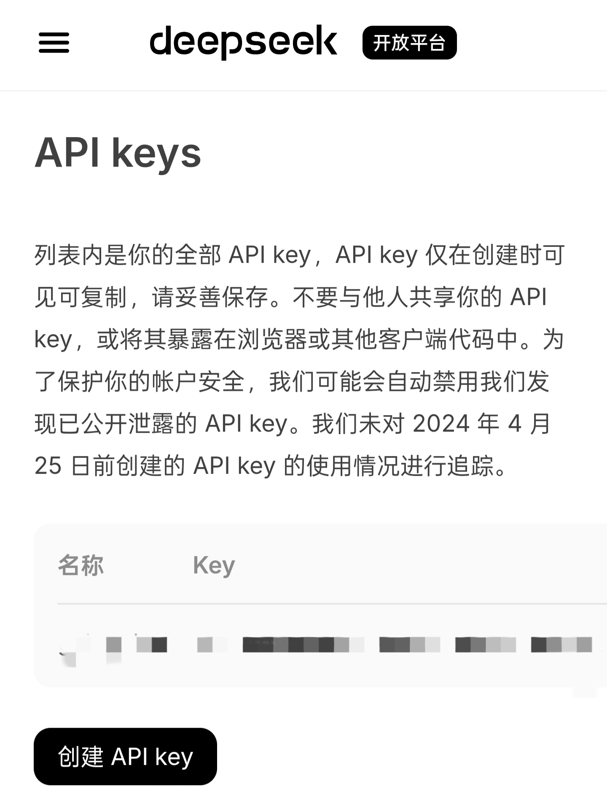

# 注意！API key的拥有者可以在您不知情的情况下直接使用您的账户余额用于AI对话，请不要向任何人泄露您的API key，以免造成不必要的纠纷或财产损失。
### 不同AI服务商的API获取方式各不相同，这里以Deepseek为例说明。
- **浏览器搜索Deepseek开放平台，注册/登陆您的账号**
- **点击左侧三条线，选择API keys，点击创建API key。**
- **输入一个名称后点击创建，在弹出的对话框中复制并妥善保存您的API key。**

### Tips：Deepseek每百万tokens输出价格为3元，请根据实际需要进行充值。（数据更新于2025年12月13日）